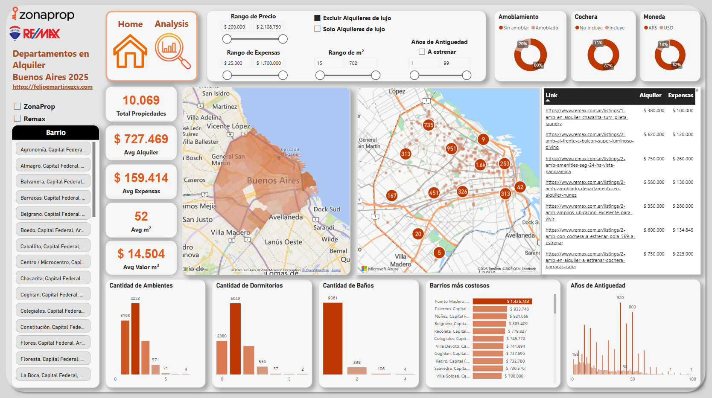

# Departamentos en alquiler Buenos Aires

Este proyecto realiza **web scraping**, **procesamiento de datos** y **visualizacion de datos** sobre departamentos en alquiler en la Ciudad de Buenos Aires, utilizando fuentes como Zonaprop y Remax.

## Objetivo

Obtener, unificar y analizar datos de departamentos en alquiler en CABA para:

- Identificar tendencias del mercado
- Detectar zonas más accesibles o más caras
- Facilitar la busqueda de departamentos
- Analizar variables como precio, superficie, ubicación y amenities

## Web Scraping

Se utilizan técnicas de scraping para extraer:
- Links de propiedades
- Detalles como precio, superficie, ambientes, dirección aproximada, amenities, etc.

## Procesamiento

- Normalización de columnas
- Conversión de unidades
- Geoposicionamiento aproximado
- Unificación de datasets de distintas fuentes
- Predictor de expensas con **Machine Learning** para rellenar nulos
    * R²: 0.953
    * MAE: $21,571.68 
- Imputacion de baños, y antiguedad
- Generacion de nuevas features (como Amoblamiento)

## Visualizacion
- [Dashboard interactivo](https://app.powerbi.com/view?r=eyJrIjoiYTllMDRjYzMtODNkZi00MjZhLThiOTQtMjE3ZmZiMjMzOThmIiwidCI6IjBiMTEyY2NmLTIxZjgtNDY0ZC05ZGUxLTdiNWU2ZmJkMzY5ZCIsImMiOjR9)

## Contacto
- felimartinez072@gmail.com
- tonymestroni@gmail.com

## Aclaraciones
Este proyecto es pura y exclusivamente con fines educativos y no comerciales